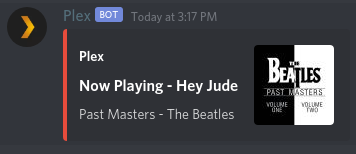

# Plex-Bot

[](http://perso.crans.org/besson/LICENSE.html)


A Python-based Plex music bot for discord.



## Setup

Plex-Bot runs entirely in a Docker container. Ensure you have Docker and docker-compose installed according to the official Docker [documentation](https://docs.docker.com/get-docker/).

1. Create a new folder and `cd` into it:

   ```bash
   mkdir Plex-Bot
   cd Plex-Bot
   ```

2. Make a `docker-compose.yml` file or use this sample:

   ```yml
   version: "3"
   services:
     plex-bot:
       container_name: "PlexBot"
       image: jarulsamy/plex-bot:latest
       environment:
         - PUID=1000
         - PGID=1000
         - TZ=America/Denver
       # Required dir for configuration files
       volumes:
         - "./config:/config:ro"
       restart: "unless-stopped"
   ```

3. Create a new `config` folder and create a config file like this::

    ```bash
    mkdir config
    cd config
    touch config.yaml
    ```

   ```yml
   # Create a file called config.yaml with the following contents

   root:
     log_level: "info"

   discord:
     prefix: "?"
     token: "<BOT_TOKEN>"
     log_level: "debug"

   plex:
     base_url: "<BASE_URL>"
     token: "<PLEX_TOKEN>"
     library_name: "<LIBRARY_NAME>"
     log_level: "debug"
   ```

4. Create a Discord bot application:

    1. Go to the Discord developer portal, [here](https://discord.com/developers/applications).

    2. Log in or create an account

    3. Click New App

    4. Fill in App Name and anything else you'd like to include

    5. Click Create App
        This will provide you with your Client ID and Client Secret

    6. Click Create Bot User
        This will provide you with your bot Username and Token

    7. Fill in the bot token in `config/config.yaml`

5. Get your plex token:

     * Refer to the official [plex documentation](https://support.plex.tv/articles/204059436-finding-an-authentication-token-x-plex-token/).

     * Add it to `config/config.yaml` in the appropiate spot.

6. Customize remaining settings

    Set any remaining settings in the config file that you would like. Such as music library, and base url of the Plex server.

7. Start the service:

   ```bash
   docker-compose up -d
   ```

## Logs

You can view the logs with the following command

```bash
docker-compose logs -f CONTAINER_NAME_OR_ID

# For example
docker-compose logs -f PlexBot
```

## Usage

```text
General:
    kill [silent] - Halt the bot [silently].
    help - Print this help message.
    cleanup - Delete old messages from the bot.

Plex:
    play <SONG_NAME> - Play a song from the plex server.
    album <ALBUM_NAME> - Queue an entire album to play.
    np - Print the current playing song.
    stop - Halt playback and leave vc.
    pause - Pause playback.
    resume - Resume playback.
    clear - Clear play queue.

[] - Optional args.
```

* * *
